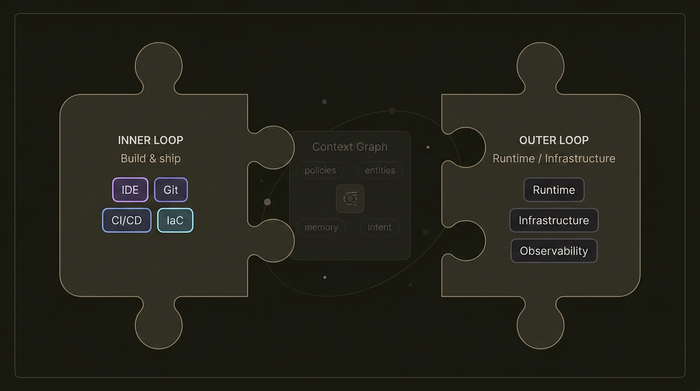
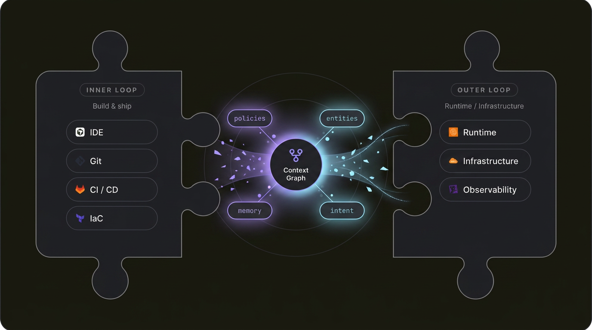
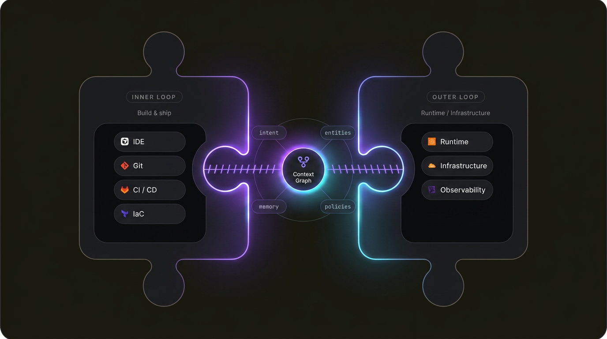
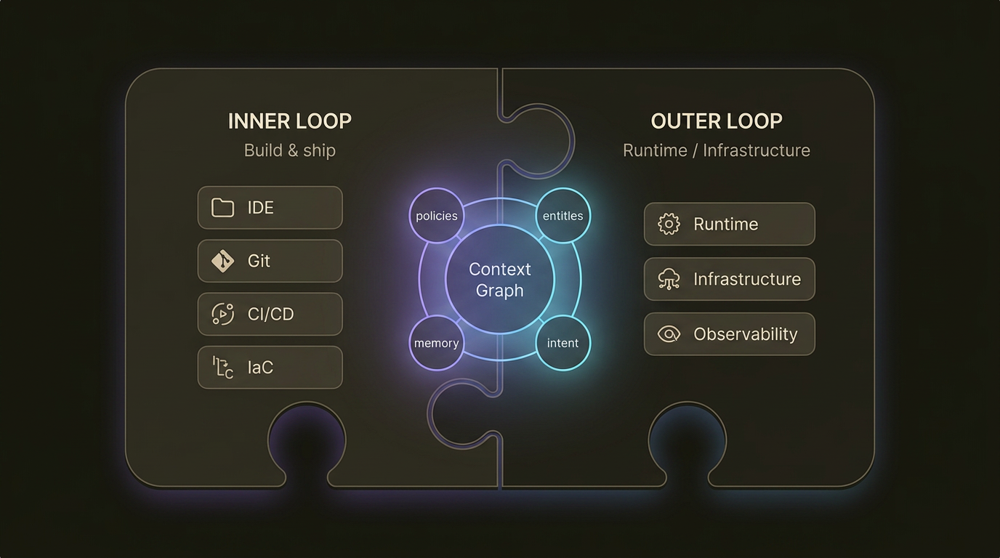

# Inner/Outer Loop Puzzle Stitch Concept Frames

Model: `gemini-3-pro-image`
Source: `exports/web-shelf/inner-outer-loop-v2/RBepL.png`

## Motion Thesis

Inner Loop (IDE/Git/CI/IaC) and Outer Loop (Runtime/Infrastructure/Observability) are two halves of the SAME puzzle. Context Graph is the stitcher that gathers shards and locks the full picture for agents — classic jigsaw tabs/sockets — unmistakable without labels.

### Frames

- **Frame A (Scatter):** Halves slightly apart / misaligned; chips feel like loose puzzle facets; hub dim; few faint particles; dashed orbit quiet.
- **Frame B (Gather):** Particles/shards stream from both sides toward hub; faint stitch threads drawing; satellites (intent/entities/policies/memory) waking; halves start closing the gap.
- **Frame C (Stitch):** Context Graph bright lock/pulse; violet stitch seams connecting left→hub→right; labels transforming (edit→drift-check style energy); satellites pulsed; puzzle edge silhouettes interlocking.
- **Frame D (Assembled):** One continuous picture; halves flush; hub calm glow; stitch seams settled; full picture readable for agents; editorial B2B tech.

## Files
- 
- 
- 
- 
